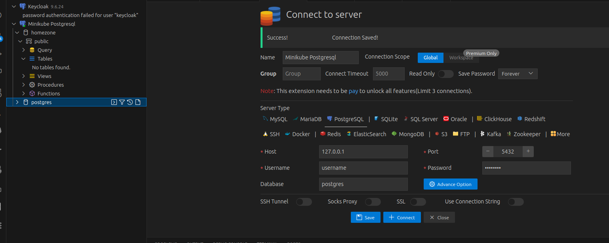

# Postgresql


## Installation de postgresql

Création du PersistentVolume avec pv.yml, vous devez indiquer une zone de stockage pour vos données.

```yaml
apiVersion: v1
kind: PersistentVolume
metadata:
  name: postgres-pv
  labels:
    type: local
spec:
  storageClassName: manual
  capacity:
    storage: 1Gi
  accessModes:
    - ReadWriteOnce
  hostPath:
    path: "/mnt/data/elfeo/Projets/react-golang-oauth/database/data" # TODO: Doit être changer en fonction de votre poste.
```

PersistentVolumeClaim, pvc.yml

```yaml
apiVersion: v1
kind: PersistentVolumeClaim
metadata:
  name: postgres-pvc
spec:
  storageClassName: manual
  accessModes:
    - ReadWriteOnce
  resources:
    requests:
      storage: 1Gi
```

```bash
$ kubectl create namespace postgresql
$ kubectl apply -n postgresql -f pv.yml 
$ kubectl apply -n postgresql -f pvc.yml

$ export ADMIN_PASSWORD=password
$ export USER_NAME=postresql
$ export USER_PASWWORD=password
$ export DATABASE=homezone

$ helm repo add bitnami https://charts.bitnami.com/bitnami
$ helm -n postgresql install postgres bitnami/postgresql \
    --set primary.persistence.existingClaim=postgres-pvc \
    --set volumePermissions.enabled=true \
    --set global.postgresql.auth.postgresPassword=${ADMIN_PASSWORD} \
    --set global.postgresql.auth.username=${USER_NAME} \
    --set global.postgresql.auth.password=${USER_PASWWORD} \
    --set global.postgresql.auth.database=${DATABASE}
```


```bash
NAME: postgres
LAST DEPLOYED: Mon Sep 25 09:09:30 2023
NAMESPACE: postgresql
STATUS: deployed
REVISION: 1
TEST SUITE: None
NOTES:
CHART NAME: postgresql
CHART VERSION: 12.12.5
APP VERSION: 15.4.0

** Please be patient while the chart is being deployed **

PostgreSQL can be accessed via port 5432 on the following DNS names from within your cluster:

    postgres-postgresql.postgresql.svc.cluster.local - Read/Write connection

To get the password for "postgres" run:

    export POSTGRES_ADMIN_PASSWORD=$(kubectl get secret --namespace postgresql postgres-postgresql -o jsonpath="{.data.postgres-password}" | base64 -d)

To get the password for "username" run:

    export POSTGRES_PASSWORD=$(kubectl get secret --namespace postgresql postgres-postgresql -o jsonpath="{.data.password}" | base64 -d)

To connect to your database run the following command:

    kubectl run postgres-postgresql-client --rm --tty -i --restart='Never' --namespace postgresql --image docker.io/bitnami/postgresql:15.4.0-debian-11-r39 --env="PGPASSWORD=$POSTGRES_PASSWORD" \
      --command -- psql --host postgres-postgresql -U username -d homezone -p 5432

    > NOTE: If you access the container using bash, make sure that you execute "/opt/bitnami/scripts/postgresql/entrypoint.sh /bin/bash" in order to avoid the error "psql: local user with ID 1001} does not exist"

To connect to your database from outside the cluster execute the following commands:

    kubectl port-forward --namespace postgresql svc/postgres-postgresql 5432:5432 &
    PGPASSWORD="$POSTGRES_PASSWORD" psql --host 127.0.0.1 -U username -d homezone -p 5432

WARNING: The configured password will be ignored on new installation in case when previous PostgreSQL release was deleted through the helm command. In that case, old PVC will have an old password, and setting it through helm won't take effect. Deleting persistent volumes (PVs) will solve the issue.
```


Test 

```bash
$ kubectl port-forward --namespace postgresql svc/postgres-postgresql 5432:5432
```





Exposition via hostname **postgresql.homezone.dev**

```yaml
---
apiVersion: networking.k8s.io/v1
kind: Ingress
metadata:
  name: postgresql-ingress
  annotations:
    kubernetes.io/ingress.class: nginx
spec:
  rules:
    - host: postgresql.homezone.dev
      http:
        paths:
          - path: /
            pathType: Prefix
            backend:  
              service:
                name: postgres-postgresql
                port:  
                  number: 5432
```

```bash
$ kubectl apply -n postgresql -f ingress.yml 
```